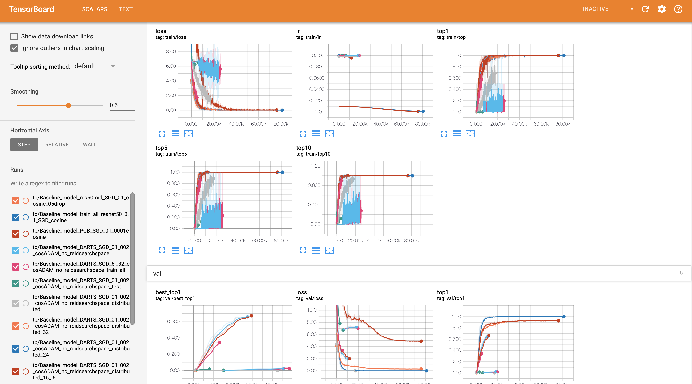
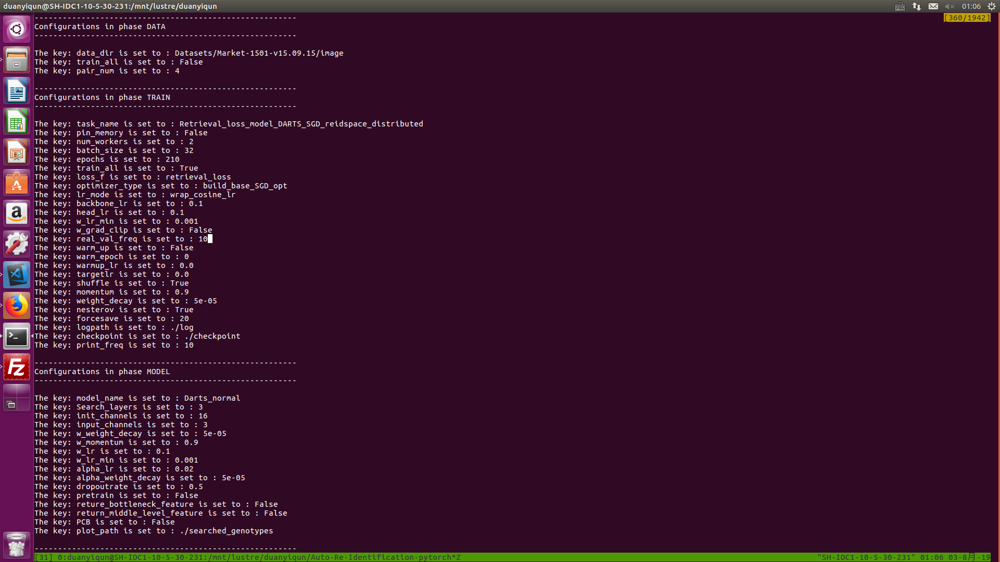

# Implementation of Paper Auto-Reid 

This is a fast re-implementation of paper [Auto-ReID: Searching for a Part-aware ConvNet for Person Re-Identification](https://arxiv.org/abs/1903.09776). 

## Features & Introductions. 

+ Please note that this repo is based on Cuda 8.0+ and Cudnn related to them. 

+ This model is tested on Cuda 9.0 9.1 and 10.0 and related cudnn libs on ubuntu server 14 and 16.

+ Also please note that this implementation support distribution training and testing. In that case, if you have enough GPUs, you could simply train a network very fast, eg. batch size 2048. 

+ However, please do not use a batch size smaller than 2*your_gpus, because that will cause bn failure. At the same time, check that your PyTorch > = 1.0 and slurm is installed on your server.
Also, please note that if sub batch size (batch size // world_size) is compared small, it may have a decreased final performance. A preferred setting is batch size 128-512. However, for DARTS searching structures, which may require a higher single card memory, batch_size 16-64 have been tested successfully to get the correct result. 

+ I made this repo with compared higher modularity. So that it may become a training platform for similar re-id projects or task-specific NAS (DARTS) projects. 

+ The training program could be automatically generated based on the parameters in configs. 
The main entry point could automatically build training based on YAML file.

+ The training could be visualized through TensorboardX.
All the checkpoints and searched graph structures are automatically saved into subfolder based on the task_name.

Update August 2th: integrate DARTS genotypes into tensorboard, you could see how structure changes during training right now!


### Features to add 

+ Add apex support for distributed training.
+ Improve the paper
+ Install as a lib
  


## Dependency & Install

```bash
conda create -n auto-reid python=3.6
conda install pip
conda install -c pytorch torch torchvision
conda install pyyaml
pip install graphviz
pip install tensorboardX
pip install apex


python setup.py install
```

## Run Training and Searching 

```
bash scripts/prepare_datasets/prepare_market.py
srun -n your_node_nums --gres gpu:gpunums -p your_partition python train_baseline_search_triplet.py --distributed True --config configs/Retrieval_classification_DARTS_distributed_triplet.yaml
```

## Visualize the training


--------------------------------------------------------

复现流程和思路:

+ day2: Jully 30 
  + 首先仔细看了一下论文的技术细节，熟悉了一下re-id 这个任务。这篇论文由UTS和百度联合提出，主要做的contribution有三点。 第一点， 第一个把NAS类型的结构搜索方式应用到re-id 这个task 当中。第二点， 根据re-id特别设计了一个OP，他们claim这个op 叫part-aware module。第三点， 把人脸re-id里面常用的triplet loss 迁移过来，并且根据论文中的描述，这种按类采样应该是online 的一种triplet， 然后用一个$\lambda$ 参数平衡cross entropy和triplet loss。 
  + 第二步，决定将这个项目做成一个类似训练平台的东西，利用YAML file 自动构建训练超参数和网络结构。 这样的好处是可以快速复现其他论文。在架构中模型，loss function， dataloader，data sampler， 分布式后端， 可视化， tensorboardX 可视化，模型checkpoint 都分别做了封装，都可以轻松替换掉。 
  + 第三步，首先复现了PCB和plain res50 的固定网络baseline， 一般使用train_baseline.py 函数配合config实现。 训练log 见 ./log 下面的文件。 这部分使用单卡训练。 
  + 第四步，初始化一个DARTS的环境，在实现上面可能比较靠近我目前在做的 one-shot search。model.DARTS 下面的文件为例，抽象为一个super net 然后在supernet中优化alpha。 DARTS 对内存的消耗非常之大，并且主要消耗是在网络层面，减小batch size 可能并不能有效减小消耗。可能不能完全重现V100 的设置 （32 bs 8 layer 4 node）。 但为了保持和论文中一模一样，我首先还是考虑实现单卡版本。这时 Part-aware module 并未加入。 
  + 第五步，train baseline PCB res50 baseline和论文中设置一模一样， 没有retrieval loss， 最终结果 Res50 93.7 PCB 93.8 
  + 第六步，果然DARTS 在1080上内存溢出， 只能保证2 batch size 需要写一个分布式后端。
+ day3: 
  + 开始解决内存溢出的问题，（用几张1080 模仿v100），考虑使用torch的后端，自己实现了sampler 分布式的分发。解决了rank 同步，模型同步，结构同步，metric 同步等问题 （分布式这部分用时较长）基于slurm 集群来做
+ day4: 
  + 解决分布式batch 采样的问题，开始测试并且撰写 Part aware module
+ day5: 
  + 解决按类采样的问题， 这个问题和分布式后端加在一起比较难处理，后来还是维护了一个长list
  + triplet loss 加速，循环的方法太慢了， 采用矩阵优化，这部分我写的比较细，加了注释。特别值得注意的一点是，目前这个论文里面的triplet loss 公式可能写错了， 他的正样本和负样本符号写反了，这个实现里改掉了错误的loss。
  + part_aware Module 集成到DARTS 搜索空间， debug 解决feature map 对其。优化了repeat模块，减少内存消耗和操作。
  + 集成测试，训练，可视化，编写readme
 

对于可能的后续改进来说，可能有两个方面
  1. 往搜索方面做，这篇论文对于搜索空间上来说可能只是改变了一个op， 对拓扑没有限制，对其他op也没有限制，如果后续改进这可能是一个方向。
  2.  往re-id 的openset上面做，感觉工程上面openset 会更加实用一些。  

接下来是训练的一些可视化

TensorBoard 可视化：


训练可视化
特别打印了每个卡的参数



搜索出的图可视化


